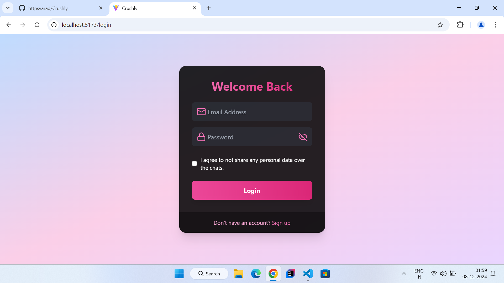
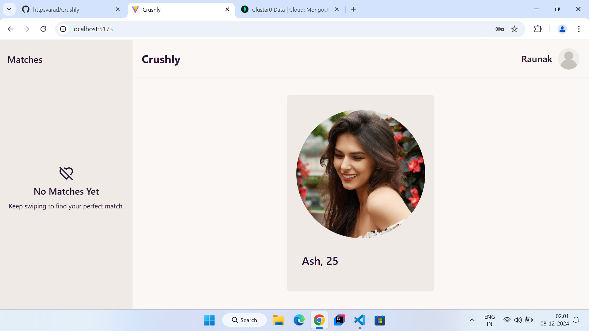
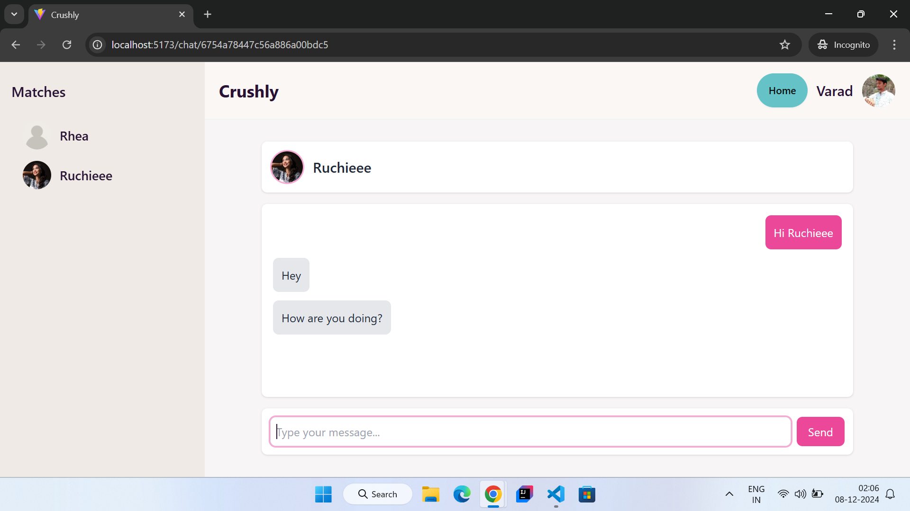

# Crushly Dating App 💝  

Welcome to **Crushly**, a modern dating app where users can swipe, match, and connect in real-time. Built with the **MERN stack**, this app leverages **Socket.IO** for real-time notifications, interactive UI components, and seamless matchmaking experiences.  

---

## Features ✨  

### 1. **Real-Time Communication with Socket.IO**  
- **Socket.IO** powers real-time notifications for matches and messages, ensuring users stay instantly connected.  
- Dynamic updates without page refreshes for an engaging experience.  

### 2. **Swipe to Match**  
- Intuitive **React Tinder Card** component allows users to swipe right to like or left to pass.  
- Matches are updated live, creating an interactive matchmaking process.  

### 3. **User Profiles Based on Preferences**  
- Profiles are displayed based on user preferences like age, location, and interests for personalized matchmaking.  
- Optimized profile suggestions for better compatibility and higher match rates.  

### 4. **User Profile Management**  
- Dedicated **Profile Page** where users can update their, profile image, bio, preferences and other profile details. 

### 5. **Secure Authentication**  
- Authentication includes secure JWT-based session handling.   

### 6. **Modern Tech Stack**  
- **Frontend**: React.js, React Tinder Card, Tailwind CSS  
- **Backend**: Node.js, Express.js  
- **Database**: MongoDB  
- **Real-Time Communication**: Socket.IO  
- **Media Management**: Cloudinary  
- **Email Services**: Nodemailer  

---

## Installation & Setup ⚙️  

Follow these steps to get Crushly up and running:  

### 1. Clone the Repository  
```bash  
git clone https://github.com/your-username/crushly.git  
cd crushly  
```  

### 2. Install Dependencies  
#### Frontend  
```bash  
cd client  
npm install  
```  
#### Backend  
```bash  
cd server  
npm install  
```  

### 3. Set Up Environment Variables  
Create a `.env` file in the root of the **server** folder with the following variables:  
```env  
MONGO_URI=your_mongodb_connection_string  
JWT_SECRET=your_jwt_secret  
CLOUDINARY_NAME=your_cloudinary_cloud_name  
CLOUDINARY_API_KEY=your_cloudinary_api_key  
CLOUDINARY_API_SECRET=your_cloudinary_api_secret
PORT=server_port 
```  

### 4. Start the App  
#### Backend  
```bash  
cd server  
node index.js  
```  
#### Frontend  
```bash  
cd client  
npm run dev  
```  

---

## Screenshots 📸  

Login
  

Home Page
  

Chat Page
   

---

## Contact 🚀  
For any queries or suggestions, feel free to reach out:
**Email**: varad.manegopale28@gmail.com   

Let’s build connections together!
